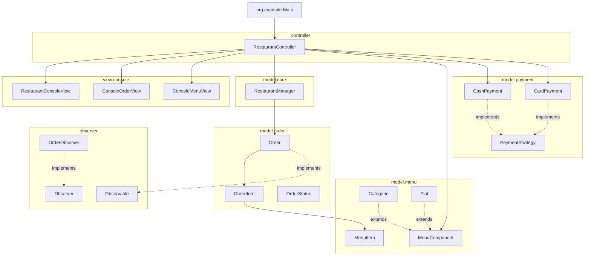
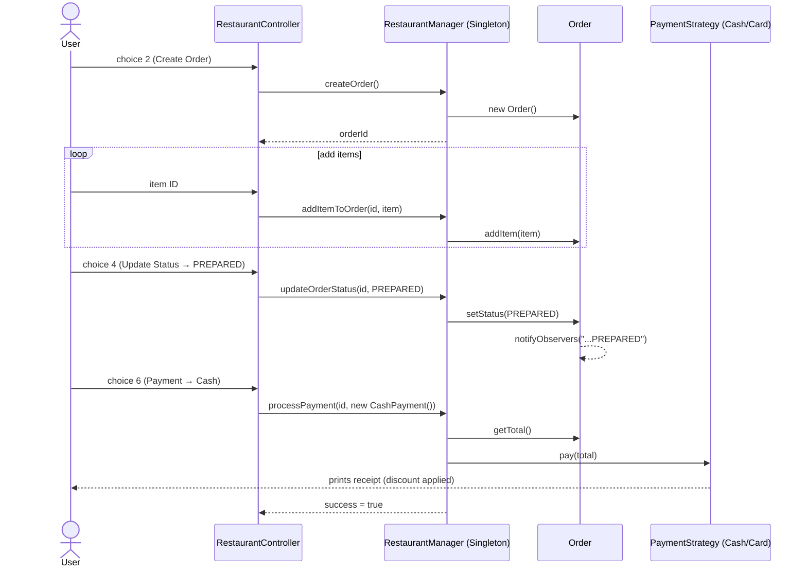
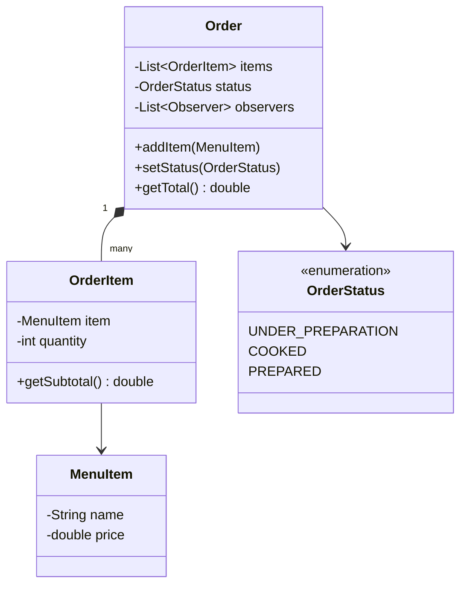

# 🏗️ Architecture — Restaurant Management System

This document explains the system's structure, the design patterns it applies, how data
flows through a typical request, and the known gaps between the intended design and the
current implementation.

---

## 1. Architectural Style

The system follows a **layered MVC-style architecture**:

```
┌─────────────────────────────────────────────────────────┐
│  View Layer (console/*)                                 │
│  Pure I/O — prints menus, reads no business logic        │
├─────────────────────────────────────────────────────────┤
│  Controller Layer (RestaurantController)                 │
│  Orchestrates use cases, translates user input into      │
│  calls on the model, formats results for the view         │
├─────────────────────────────────────────────────────────┤
│  Model Layer (model/*)                                   │
│  Domain objects + business rules (Order, MenuItem,        │
│  PaymentStrategy, RestaurantManager)                       │
├─────────────────────────────────────────────────────────┤
│  Cross-cutting: Observer (observer/*)                     │
│  Decouples state changes from whoever reacts to them       │
└─────────────────────────────────────────────────────────┘
```

The controller depends on the model and the view; the model has **no dependency on the
view or controller** — this is what makes it possible to swap the console UI for a GUI
or REST API later without rewriting business logic.

---

## 2. Package Diagram



---

## 3. Design Patterns in Detail

### 3.1 Singleton — `RestaurantManager`, `MenuComponent`

**Problem:** Orders and the menu need one consistent, globally-reachable state; creating
multiple `RestaurantManager` instances would fragment order data across the app.

**Implementation:** Classic lazy-initialized singleton with a private constructor and a
static `getInstance()` / `getMenu()` accessor. `RestaurantManager.getInstance()` is
synchronized for thread-safety.

```java
public static synchronized RestaurantManager getInstance() {
    if (instance == null) {
        instance = new RestaurantManager();
    }
    return instance;
}
```

**Trade-off worth knowing:** Singletons make unit testing harder (global mutable state)
and hide the dependency from constructors. For a console app this is an acceptable
trade-off; if this evolves into a multi-request server, this state should move to a
request-scoped or injected dependency instead.

---

### 3.2 Strategy — `PaymentStrategy`

**Problem:** Cash and card payments each need different pricing math (discount vs. fee)
and different receipt formatting, but `RestaurantManager.processPayment()` shouldn't
need an `if/else` for every payment type it might ever support.

**Implementation:** `PaymentStrategy` defines `calculateTotal()`, `pay()`, and
`getPaymentName()`. `CashPayment` and `CardPayment` each encapsulate their own rule
(5% discount / 2% fee) and are passed into `RestaurantManager.processPayment()` as
an interchangeable strategy object:

```java
boolean success = restaurantManager.processPayment(currentOrderId, new CashPayment());
```

**Extensibility payoff:** adding a new payment method (e.g. mobile wallet) means adding
one new class — zero changes to `RestaurantManager` or `RestaurantController`.

---

### 3.3 Observer — `Observable` / `Observer`

**Problem:** When an order's status changes, potentially many parts of a real system
care (kitchen display, customer notification, analytics/logging) — but `Order` shouldn't
need to know about any of them directly.

**Implementation:** `Order` implements `Observable`, maintains a list of `Observer`s, and
calls `notifyObservers(...)` on every `setStatus()`:

```java
public void setStatus(OrderStatus status) {
    this.status = status;
    notifyObservers("Order status changed to: " + status);
}
```

`OrderObserver` is a ready-made concrete listener that logs the message to the console.

> **⚠️ Current gap:** no `OrderObserver` is ever registered on an `Order` instance in
> `RestaurantController` or anywhere else in the code — `notifyObservers()` currently
> fires to an empty list. The pattern is fully implemented but not yet *wired up*. This
> is a one-line fix (`order.addObserver(new OrderObserver())` when an order is created)
> and is called out explicitly in the README roadmap so it doesn't read as an oversight.

---

### 3.4 Composite — `MenuComponent` / `Categorie` / `Plat`

**Problem:** A real restaurant menu is hierarchical — categories contain dishes, and
sometimes categories contain sub-categories. Client code should be able to call
`display()` on the whole menu, a category, or a single dish, without caring which.

**Implementation:** `MenuComponent` is the component supertype; `Plat` is a leaf (single
dish), `Categorie` is a composite that holds a `List<MenuComponent>` and forwards
`display()` to each child recursively.

> **⚠️ Current gap:** `MenuComponent` also carries a *second*, unrelated responsibility —
> a hardcoded Singleton `display()` used by `RestaurantController.handleShowMenu()` — and
> the order-creation flow (`createMenuItemById`) uses a hardcoded `switch` instead of
> walking a real `Categorie`/`Plat` tree. In other words: the Composite structure is
> correctly built, but the controller doesn't consume it yet. Building an actual menu
> tree once (`Categorie "Mains" → Plat "Pizza", Plat "Burger", ...`) and iterating it in
> the controller would complete this pattern's intended use — listed in the README
> roadmap.

---

## 4. Data Flow — "Create Order → Pay" Walkthrough



Key invariant enforced in `RestaurantManager.processPayment()`: **payment is rejected
unless the order's status is `PREPARED`**, preventing checkout on unfinished orders.

---

## 5. Domain Model



---

## 6. Why This Structure Scales Well

- **Adding a payment method** → new `PaymentStrategy` implementation, no existing code touched.
- **Adding a UI (web/GUI)** → new view + controller adapter; `model/*` is untouched because it has zero view dependencies.
- **Adding menu categories** → the `Composite` structure already supports arbitrary nesting once the controller consumes it.
- **Adding notifications (email/SMS on status change)** → new `Observer` implementation, registered against `Order`, with zero changes to `Order` itself.

---

## 7. Known Limitations (honest assessment)

| Limitation | Impact | Suggested Fix |
|---|---|---|
| `Observer` pattern implemented but never registered | Status-change notifications are silently dropped | Register an `OrderObserver` in `RestaurantController.handleCreateOrder()` |
| `Composite` menu tree built but not used by the controller | Menu is effectively hardcoded, defeating the purpose of the pattern | Build a static `Categorie` tree once at startup and iterate it instead of `createMenuItemById`'s switch |
| In-memory storage only (`HashMap` in `RestaurantManager`) | All orders lost on restart | Add a persistence layer (file, SQLite, or JDBC) behind the same `RestaurantManager` API |
| No automated tests | Regressions won't be caught | Add JUnit tests for `RestaurantManager`, `PaymentStrategy` implementations, and `Order` |
| `RestaurantManager` Singleton makes testing harder | Hard to isolate state between test runs | Consider dependency injection if the project grows beyond a console demo |

Documenting these transparently is intentional — it shows the patterns were applied with
understanding of their trade-offs, not just copy-pasted, and gives a clear, credible
"next steps" story for anyone reviewing the repo (including yourself in six months).
